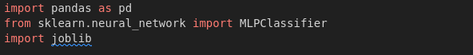
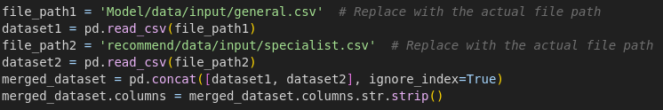
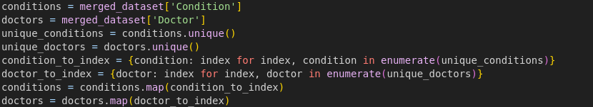
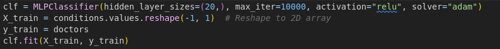

<h1> Doctor Recommendation Model Training Script </h1>

This project contains a Python script for training a neural network model to recommend doctors based on specific medical conditions. Using two datasets, this script prepares, trains, and saves a model that associates medical conditions with relevant doctors.

<h2>Table Of Contents</h2>

<ul>
<li>Installation</li>
<li>File Description</li>
<li>Usage</li>
<li>Code Explanation </li>
<ol>
<li>Import Libraies</li>
<li>Load & Merge dataset</li>
<li>Prepare data for Training </li>
<li>Train the Model </li>
<li>Save the Model </li>
</ol>
<li>Further Development</li>
</ul>

<h3>Prerequisites</h3>
<ul>
<li>Python 3.x</li> 
<li>Libraries: </li>
<ul>
<li>pandas for data manipulation.</li> 
<li>scikit-learn for machine learning model training. </li>
<li>joblib for model serialization. </li>
</ul>
</ul>

<h2>Installation</h2>
<ol>
<li>Clone or download this repository.</li>
<li>Install the required Python packages using pip:</li>
 

<b>pip install pandas scikit-learn joblib</b>

<h3>File Description</h3>
<ul>
<li>general.csv: Contains data on general medical conditions and associated doctors.
</li> 
<li>specialist.csv: Contains data on specialist conditions and relevant doctors.</li>
<li>model.pkl: Output file where the trained model is saved for future use.</li>
<li>README.md: Documentation for the project, including installation, usage, and code explanations.</li>
</ul>
<h3>Usage</h3>
<ol><li>Place general.csv and specialist.csv files in the designated input folder.
</li><li>Run the script. The trained model will be saved as model.pkl in the output folder.</li></ol>
</ol>

<h2>Code Explanation</h2>

<ol>
<li><h3>Import Libraries<h3></li>

<h4>The script begins by importing the necessary libraries:</h4>
<ul>
<li>pandas: for loading and manipulating data.</li>
<li>MLPClassifier from scikit-learn: to define and train a neural network model.</li>
<li>joblib: to save the trained model.</li>
</ul>

<li><h3>Load & Merge Dataset<h3></li>

<ul>
<li>Loads data from two CSV files, general.csv and specialist.csv.</li>
<li>Merges both datasets, creating a unified dataset for training.</li>
<li>Strips whitespace from column headers for consistency.</li>
</ul>

<li><h3>Prepare Data for Training<h3></li>

<ul>
<li>Extracts the Condition and Doctor columns from the dataset.</li>
<li>Maps each unique condition and doctor to a unique numeric index, making the data compatible with the model.</li>
<li>Replaces the Condition and Doctor columns with these indices.</li>
</ul>

<li><h3>Train the Model<h3></li>

<ul>
<li>Configures an MLPClassifier model with a single hidden layer (20 neurons), ReLU activation function, and Adam optimizer.</li>
<li>X_train represents conditions reshaped as a 2D array, and y_train represents doctors as labels.</li>
<li>Fits the model on the training data.</li>
</ul>

<li><h3>Save the Model<h3></li>

<ul>
<li>Saves the trained model to model.pkl using joblib. This allows you to load the model later to make predictions.</li>
</ul>
</ol>

<h2>Further Development</h2>
As this model matures, we aim to expand its functionality and versatility to better meet diverse requirements. Planned improvements include:
<ol>
<li><b>Enhanced Data Sources:</b> Integrate additional datasets to account for more conditions and specialized medical expertise, improving the model's recommendations.</li>

<li><b>Data Preprocessing Enhancements:</b></li>
<ul>
<li>Implement data validation and error handling to ensure data consistency across different datasets.</li>
<li>Integrate automated handling of missing values and outlier detection to enhance model accuracy.</li>
</ul>

<li><b>Model Performance Optimization:</b></li>
<ul>
<li>Experiment with different neural network architectures, such as deeper layers or varying neuron counts, to refine model accuracy.</li>
<li>Use techniques such as cross-validation and hyperparameter tuning (e.g., GridSearchCV) for optimal parameter selection.</li>
</ul>

<li><b>Model Evaluation and Tracking:</b></ul>
<ul>
<li>Develop an evaluation pipeline using metrics like accuracy, precision, and recall.</li>
<li>Track model performance over time by logging results with frameworks like MLflow.</li>
</ul>
<li><b>Deployment and API Integration:</b></li>
<ul>
<li>Build a REST API with FastAPI or Flask, allowing real-time access to doctor recommendations based on conditions.</li>
<li>Deploy the model to a cloud-based service (e.g., AWS, Google Cloud) to support remote access and scalability.</li>
</ul>

<li><b>User Personalization:</b></li>
<ul>
<li>Implement user-specific recommendations based on historical data, location, and other contextual factors.</li>
<li>Integrate feedback mechanisms to continuously improve recommendations based on user input.</li>
<ul>
</ol>
These improvements will make the system more reliable, scalable, and personalized.